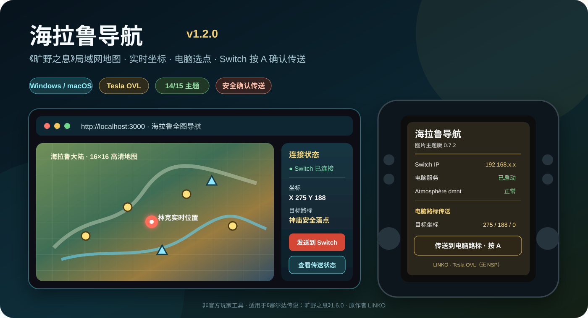

# 海拉鲁导航 v1.2.0

<p align="center">
  
</p>

<p align="center">
  <strong>《塞尔达传说：旷野之息》局域网全图导航、实时坐标与确认传送工具</strong><br>
  电脑端选择目标，Switch 端通过 Tesla OVL 核对坐标并按 A 确认。
</p>

<p align="center">
  
  
  
  
</p>

> 本仓库用于发布海拉鲁导航成品包和安装说明。项目为非官方玩家工具，不包含游戏、ROM、密钥、固件、存档或任天堂官方资源。

## 当前版本

| 项目 | 当前版本 / 设置 |
| --- | --- |
| 电脑端应用 | `1.2.0` |
| Switch Tesla OVL | `图片主题版 0.7.2` |
| Tesla 面板透明度 | `14 / 15`，基本不透，仅保留轻微层次感 |
| 游戏版本 | 《旷野之息》`1.6.0` |
| Title ID | `01007EF00011E000` |
| Build ID | `8E9978D50BDD20B4C8395A106C27FFDE` |
| Switch 服务端口 | `37890` |
| 电脑网页端口 | `3000` |
| 作者标注 | `LINKO` |

其他游戏版本以及《王国之泪》不能直接使用当前插件。

## 下载最新版

当前 v1.2.0 成品由 GitHub Actions 自动构建：

- [打开最新版构建页面](https://github.com/cuijunhao20000307-web/-2.0/actions)
- 进入最新一次成功的 **Build Hyrule Navigator 1.2 Fixed Package**
- 在页面底部 **Artifacts** 下载 `海拉鲁导航-v1.2.0-图片主题修正版`

源代码与自动构建配置位于：

- [海拉鲁导航 v1.2 源代码仓库](https://github.com/cuijunhao20000307-web/-2.0)

## 主要功能

- **16 × 16 高清全图**：电脑端显示完整海拉鲁地图，并支持地点、神庙、塔等标记浏览。
- **实时坐标和朝向**：Tesla OVL 通过 Atmosphère `dmnt` 读取当前林克位置和方向。
- **电脑选点发送**：在地图上选择目标后，直接发送到同一 Wi-Fi 下的 Switch。
- **Switch 二次确认**：目标不会在电脑端直接执行，必须在 Tesla 面板核对并按 A 确认。
- **传送状态回传**：电脑端持续查询等待、确认、执行、成功或失败状态。
- **图片主题 Tesla 界面**：当前 OVL 使用图片主题，背景不透明度为 `14/15`，文字更加清楚。
- **仅 Tesla OVL**：不需要 NSP 后台程序，服务只在插件和游戏运行期间工作。
- **Windows 与 macOS**：成品包包含 Windows 启动器、批处理脚本和 macOS 启动脚本。
- **手机和平板访问**：电脑启动后，同一局域网设备可通过电脑 IP 打开地图页面。
- **自动停止保护**：游戏关闭或连接中断后，插件会停止服务并取消未完成目标。
- **中文图文说明书**：成品包附带安装、连接、传送与故障排查 PDF。

## v1.2.0 更新重点

相较旧版 v1.1.0，当前版本完成了以下调整：

- 电脑端、Switch 端和传送状态统一使用端口 `37890`
- 修复电脑选择位置后无法继续完成 Switch 传送的问题
- 传送请求保留并持续轮询，不再发送后立刻清空
- 地图使用完整高清切片，缩放按钮移动到右侧并缩小占用空间
- Tesla 插件改为图片主题版 `0.7.2`
- Tesla 背景透明度调整为 `14/15`
- 增加 LINKO 作者标注与非商用提示
- Windows、macOS、Switch 文件重新分类打包
- 安装说明升级为中文图文 PDF

## 快速安装

### 1. 安装 Switch 端

1. 完全关闭 Switch，并将 SD 卡连接电脑。
2. 解压下载的完整包。
3. 打开 `Switch端/直接复制到SD卡根目录`。
4. 将里面的全部文件复制到 SD 卡根目录并选择合并或覆盖。
5. 确认以下文件存在：

```text
SD:/switch/.overlays/HyruleBridgeUltra.ovl
SD:/config/hyrule-navigator/theme.ini
SD:/config/hyrule-navigator/wallpaper.rgba
SD:/config/hyrule-navigator/config.ini
```

6. 删除旧的同名 OVL，只保留当前版本。
7. 安全弹出 SD 卡并插回 Switch。

### 2. 启动电脑端

电脑需安装 Node.js 22 或更高版本。

- **Windows**：双击 `电脑端/Windows/海拉鲁导航.exe`，也可使用批处理启动文件。
- **macOS**：双击 `电脑端/macOS/启动海拉鲁导航.command`。
- 本机页面：`http://localhost:3000`
- 手机或平板：`http://电脑局域网IP:3000`

电脑、手机和平板、Switch 必须连接同一个普通 Wi-Fi。请关闭 VPN，并避免使用访客网络或启用了设备隔离的热点。

### 3. 连接 Switch

1. 启动《旷野之息》1.6.0，并进入可以正常控制林克的实际存档。
2. 打开 Tesla 菜单并启动“海拉鲁导航”。
3. 查看 Tesla 面板显示的 Switch IP。
4. 在电脑地图中输入该 IP，并点击连接。
5. 页面显示坐标和朝向后即可开始使用。

网页直接访问：

```text
http://Switch-IP:37890/v1/position
```

不需要 FTP，也不需要额外 NSP 后台服务。

## 电脑选点与确认传送

1. 在电脑地图上选择目标位置或标记。
2. 点击“发送到 Switch”。
3. 打开 Tesla → 海拉鲁导航。
4. 检查“电脑目标”“目标坐标”和“传送状态”。
5. 选择“传送到电脑路标”，按 A 确认。
6. 等待电脑端显示执行结果。

### 安全提醒

- 使用前先在游戏内正常保存。
- 尽量选择神庙入口、塔附近或普通平坦陆地。
- 不要选择水面、悬空位置、建筑内部、洞穴、桥面或加载边界。
- 不要在读档、过场、攀爬、滑翔、游泳、骑乘或林克不可控时确认。
- 传送时避免同时打开 Edizon 或其他会占用、重新附加 `dmnt` 的工具。
- 即使通过坐标与状态校验，也无法保证所有地图位置都绝对安全。

## 常见问题

### Tesla 菜单里找不到插件

检查文件是否位于：

```text
SD:/switch/.overlays/HyruleBridgeUltra.ovl
```

同时删除重复旧版，避免存在多个同名或不同版本 OVL。

### 电脑显示未连接

- 核对 Tesla 面板中的 Switch IP
- 确认电脑与 Switch 在同一 Wi-Fi
- 关闭 VPN、防火墙拦截和访客网络隔离
- 确认游戏已经进入可控制林克的存档
- 在 Tesla 中重新启动服务

### 电脑已发送，但 Switch 没有目标

- 保持 Tesla OVL 和游戏运行
- 检查端口是否为 `37890`
- 重新连接 Switch IP 后再次发送
- 确认使用的是 v1.2.0 电脑端与 0.7.2 OVL，而不是混用旧文件

### 图片主题没有显示

确认以下两个文件已经复制：

```text
SD:/config/hyrule-navigator/theme.ini
SD:/config/hyrule-navigator/wallpaper.rgba
```

## 项目说明

- 原作者／二创作者标注：**LINKO**
- 当前项目仅用于个人学习、测试与非商业分享
- 未经允许请勿商用、重新收费打包或冒充官方版本
- Nintendo、The Legend of Zelda、游戏名称、画面与相关标识的权利归各自权利人所有
- 本项目与 Nintendo、任天堂及其关联公司无官方关系
